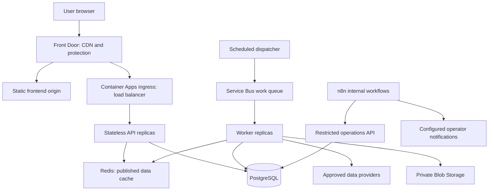

# SIP Saathi: end-to-end build and scaling plan

Status: proposed implementation plan; no infrastructure has been provisioned. Updated September 7, 2026.

## 1. Product and scope

Build a mobile-friendly website that collects a goal, target amount, deadline, investable monthly amount, existing savings, liquidity needs, and risk/loss-capacity answers. Return a small fund research shortlist with comparable historical evidence and clear inclusion reasons. The goal calculator is optional and is not required to receive a shortlist.

The first release includes onboarding, screening, fund details, side-by-side comparison of up to three funds, methodology, educational content, and an internal data-quality console. Accounts, payments, portfolio aggregation, and user messaging remain later features.

Calling an output a research shortlist does not itself resolve the existing personalised-advice question. The previously agreed public-launch review covers the actual screening behaviour and presentation.

## 1.1 Visual direction

The `design/` folder contains the visual reference: a mobile onboarding flow with energetic electric-blue screens, white content sheets, oversized condensed uppercase headlines, expressive money-related illustrations, short supportive copy, segmented progress, outlined inputs, and a fixed bottom action.

Use this as a visual language, not as a copy or asset source. SIP Saathi should have its own logo, illustrations, wording, and colour tokens. Do not reproduce Cleo, Mobbins branding, screenshots, or proprietary artwork.

### Design translation for SIP Saathi

| Reference pattern | SIP Saathi use |
|---|---|
| Bright blue opening and transition screens | Brand welcome, method explanation, and result moments |
| Large condensed headline | One clear question or decision per onboarding screen |
| White rounded content sheet | Form surface and comparison details |
| Segmented progress bar | Goal setup and investor-context progress |
| “Your data explained” link | “Why we ask” explanation beside sensitive inputs |
| Fixed primary action | Continue, see shortlist, or compare; one action per screen |
| Expressive illustration | Goal and investing metaphors with original artwork |
| Casual, direct copy | Friendly language with precise finance terms where needed |

### Product-specific changes

Do not copy the reference app's account-first flow. SIP Saathi opens with the value proposition and allows anonymous research. The onboarding questions are goal, target amount, deadline, monthly investable amount, existing savings, liquidity need, and risk/loss capacity. Email, name, bank login, and account linking are outside the MVP.

Keep the playful visual energy, but make risk and data explanations calm and unambiguous. Fund facts, performance periods, source dates, methodology, and disclaimers use a quieter information layout after onboarding. The bright accent is for actions and brand moments; it must not imply fund quality or investment safety.

### Initial design tokens

Design read: mobile-first fintech onboarding for beginner investors. The visual target is friendly and energetic, but the product must still feel calm and trustworthy when showing risk, performance, and source information.

#### Monochromatic colour system

Lock the brand hue to indigo at 244 degrees. Every brand colour below is a shade or tint of that hue. White and near-black are structural neutrals, not additional accent colours.

| Token | Value | Use |
|---|---|---|
| `brand-950` | `hsl(244 55% 14%)` | Deep text, dark brand surface, pressed state |
| `brand-900` | `hsl(244 62% 24%)` | Strong text, dark surface cards, focus outline on light surfaces |
| `brand-800` | `hsl(244 70% 32%)` | Hover and high-emphasis controls |
| `brand-700` | `hsl(244 78% 40%)` | Secondary action, active outline, selected state |
| `brand-600` | `hsl(244 84% 50%)` | Primary CTA, progress fill, main brand block |
| `brand-500` | `hsl(244 86% 60%)` | Illustration detail and active transition surfaces |
| `brand-400` | `hsl(244 88% 70%)` | Soft illustration detail and decorative highlight |
| `brand-300` | `hsl(244 84% 80%)` | Focus halo, selected border, soft divider |
| `brand-200` | `hsl(244 78% 89%)` | Progress track and input background tint |
| `brand-100` | `hsl(244 70% 95%)` | Quiet information panels and notification surfaces |
| `brand-050` | `hsl(244 55% 98%)` | App canvas and content-sheet tint |
| `paper` | `hsl(244 30% 99%)` | Primary content surface and readable button text |
| `ink` | `hsl(244 45% 10%)` | Body text and financial data |
| `muted` | `hsl(244 18% 42%)` | Supporting text only |
| `line` | `hsl(244 30% 86%)` | Borders and dividers |

#### Usage rules

- Primary CTA: `brand-950` with `brand-100` text. Hover uses `brand-900`; pressed uses `brand-800`; disabled uses `brand-200` with `brand-800` text. Do not use white as a button fill.
- Default page theme: light. Use `brand-050` for the canvas, `paper` for sheets, and `brand-600` for deliberate brand moments. Dark screens, if needed, use only `brand-950`, `brand-900`, and `brand-050`.
- Do not use separate green, red, purple, orange, or blue status colours. Success, warning, and error states use the same indigo scale plus an icon, explicit label, and supporting text so colour is never the only signal.
- A gradient is optional only when it stays inside the indigo hue family, such as `brand-700` to `brand-400`. Never use a multi-colour gradient or gradient text.
- Use the same palette for original illustrations. Do not reuse the reference app's multicolour artwork, logo, or screenshots.
- Check CTA text, labels, placeholders, borders, and focus rings against their actual background at implementation time. Never ship a colour token without a contrast check.

Type remains a condensed display face for short headlines and a readable sans-serif for body copy and financial data. Select licensed or self-hosted fonts during implementation. Keep the existing shape, mobile layout, reduced-motion, and accessibility rules below.

The source images are static references. Implement the layout and motion with native web components and original assets; do not ship screenshot backgrounds as the product UI.

## 1.2 Screen-first prototype

Before building the database, ingestion pipeline, Redis, queues, or n8n, build a clickable frontend prototype with local mock data. Its purpose is to validate the visual direction, wording, navigation, and mobile usability with real people.

### Prototype boundaries

- Frontend only: React, TypeScript, Vite, and the tokens in `design.md`.
- Use local in-memory state for answers. Refreshing the browser may reset the prototype.
- Use clearly labelled synthetic fund examples. Do not present mock returns as real financial data.
- No authentication, database, API calls, Redis, Service Bus, n8n, analytics, or cloud deployment in this phase.
- Keep a small data adapter between screens and mock data so the later API can replace it without rewriting the UI.

### Screen flow

The detailed screen contract lives in `design.md`. The prototype flow is:

1. Welcome
2. How it works
3. Goal
4. Target amount
5. Deadline
6. Monthly amount
7. Existing savings
8. Liquidity needs
9. Risk and loss capacity
10. Review
11. Screening state
12. Research shortlist
13. Fund detail
14. Compare

### Prototype exit gate

The phase is complete only when a tester can move from welcome to comparison on a mobile viewport without dead ends, understands what data is being requested, can correct an answer, and can distinguish synthetic examples from live fund data. Check keyboard navigation, visible focus, readable contrast, reduced motion, empty/error states, and small-screen layout before moving to backend work.

## 2. Architecture decisions

Use one backend codebase with clear screening, catalogue, data-ingestion, and administration modules. Deploy its HTTP API and background worker separately so each can scale independently. Redis, a durable queue, load balancing, and n8n have distinct responsibilities.

Azure is the planning baseline, selected for the proposed .NET backend and managed infrastructure. Region and service tiers remain deployment decisions after checking availability, data-provider terms, and an actual cost quote. This plan does not authorise cloud purchases.

| Component | Proposed choice | Responsibility |
|---|---|---|
| Frontend | React, TypeScript, Vite | Onboarding, fund views, comparison; static production build |
| Backend | ASP.NET Core on .NET 10 LTS | Validation, screening rules, public and internal APIs |
| Data access | Entity Framework Core with Npgsql | PostgreSQL queries and versioned migrations |
| Database | Managed PostgreSQL | Fund history, published snapshots, rules, job state, admin audit |
| Cache | Redis; Azure Managed Redis in production | Shared published fund data and metrics |
| Durable jobs | Azure Service Bus | Ingestion and metric-computation work, retries, dead letters |
| Worker | .NET worker container | Fetch, validate, calculate, and publish fund data |
| Scheduler | Scheduled Azure Container Apps Job | Discover due ingestion tasks and enqueue them |
| Automation | n8n, separately hosted | Internal data-health digests and operational follow-ups |
| Object storage | Azure Blob Storage | Raw provider responses, import files, snapshot manifests |
| Edge | Azure Front Door | Static delivery, route protection, origin routing |
| Regional load balancing | Container Apps managed ingress | Route requests across healthy API replicas |
| Secrets/admin identity | Key Vault, managed identities, Entra ID | Credentials, machine access, admin login and MFA |
| Observability | OpenTelemetry to Azure Monitor/Application Insights | Metrics, traces, alerts, operational dashboards |
| Delivery | Docker, GitHub Actions, Bicep | Reproducible builds, deployments, infrastructure |

.NET 10 is an LTS release supported until November 2028. Pin supported dependency versions and container digests during implementation. [Microsoft support policy](https://learn.microsoft.com/en-us/dotnet/core/releases-and-support)

### Deployment layout



The core request path never waits for a data-provider download, n8n execution, or historical recalculation. Container Apps provides managed ingress and load balancing; a second self-managed Nginx load balancer is unnecessary in this topology. [Container Apps ingress](https://learn.microsoft.com/en-us/azure/container-apps/ingress-environment-configuration)

## 3. User journey and API contract

1. Landing page explains the research output and opens a three-step form: goal, finances/liquidity, and risk answers.
2. Validate inputs in the browser and API. Identify contradictory answers, insufficient surplus, urgent liquidity, and inability to tolerate capital loss. Return an explanation or clarification state where appropriate.
3. Apply reviewed category eligibility rules, then compare eligible funds within their categories. A high target amount must never automatically increase the user's risk category.
4. Display up to three candidates, inclusion reasons, historical dates, costs, risks, and missing optional metrics. Explain the screened universe and exclusions.
5. Allow fund details, comparison, edits, official research links, and the optional goal check.

| Endpoint | Contract |
|---|---|
| `GET /api/v1/methodology` | Active rule version, universe, metric definitions, source/freshness policy |
| `POST /api/v1/screen` | Typed goal/context body; candidates, reasons, limitations, rule and snapshot versions |
| `GET /api/v1/funds` | Bounded search with pagination; published funds only |
| `GET /api/v1/funds/{id}` | Published facts, costs, metrics, sources, as-of dates |
| `GET /api/v1/funds/{id}/history` | Bounded date range and downsampled chart series |
| `POST /api/v1/compare` | Maximum three IDs from a compatible snapshot; aligned metric windows |
| `GET /internal/data-health` | Admin/service identity only; source delays, failed jobs, publication state |
| `POST /internal/imports` | Authorised source/date scope and idempotency key; returns job ID with HTTP 202 |
| `POST /internal/publications/{id}/approve` | Reviewer-only publish action with audit reason |
| `/health/live`, `/health/ready` | Process health versus ability to serve a validated publication |

Responses distinguish `matches`, `no_matches`, `needs_clarification`, and `data_unavailable`. Never relax eligibility silently to fill three slots. Return HTTP 400 for invalid payloads, 429 for throttling, and 503 for temporary infrastructure unavailability; semantic no-match results remain successful responses.

Keep financial inputs in POST bodies, exclude them from telemetry, and set screening/comparison responses to `Cache-Control: no-store`. Do not put financial answers in URLs or shared-cache keys. The optional goal calculation can run locally.

## 4. Screening methodology

Implement deterministic, versioned rules in the shared .NET domain module. n8n and language models do not calculate scores or edit published rules.

### Eligibility before comparison

Start with a reviewed, bounded universe of 30-50 direct-growth, open-ended schemes; actual inclusion depends on licensed data coverage. Distinguish regular/direct plans and growth/distribution options by identifiers. Do not combine their NAV histories.

Each category has reviewed horizon, loss-capacity, liquidity, minimum-SIP, and product-risk constraints. Those thresholds must be written and approved before real fund screening is enabled. Preserve the published scheme risk classification instead of replacing it with an invented label.

Emergency goals can produce an explanation with no mutual-fund shortlist. Missing essential metadata, overdue required disclosures, suspended subscriptions, and invalid time series exclude the affected fund.

### Historical evidence

Compute trailing 3/5/10-year CAGR where history exists; rolling 3-year returns sampled monthly; median and lower-decile rolling returns; daily-return annualised volatility; maximum drawdown; and comparison with the correct total-return benchmark over identical dates. Display the observation count, period, and method version. These are proposed analytic conventions to validate with sample data.

- CAGR: `(ending NAV / starting NAV)^(365.25 / elapsed days) - 1`.
- Rolling windows use the last available NAV on or before each monthly anchor; reject unexplained gaps instead of fabricating daily values.
- Volatility uses the sample standard deviation of daily simple returns multiplied by `sqrt(252)`; show the observation count and calculation period.
- Maximum drawdown is the minimum of `NAV / running peak NAV - 1` within the displayed period.
- Use total-return indices for benchmark comparisons. If licensed benchmark history is unavailable, omit the benchmark-dependent ranking until data is obtained.
- Require sufficient rolling observations for ranking; prototype default: three-year windows across a five-year history, with at least 24 observations. Review this threshold by category.
- A fund without ten-year history displays that metric as unavailable; it is not excluded solely for that reason. Missing required five-year coverage excludes it from that particular comparison cohort, not from general research pages.
- Historical NAV returns already reflect scheme operating expenses; do not subtract TER a second time. Exit loads and investor taxes are separate from displayed NAV performance.

Prototype ordering is category-specific: for active equity, lower-decile rolling returns, then median rolling returns, then lower expense ratio; for index funds, lower tracking difference/error, then cost; for debt funds, reviewed credit/duration/liquidity eligibility first and category-specific comparisons. These are testable proposals, not validated investment rules. Avoid a universal opaque score and keep scheme ID as a stable final tie-breaker.

Test out-of-time historical cohorts where available; document missing closed/merged schemes and survivorship bias. Do not claim future predictive accuracy from a backtest. Explanations must correspond to the exact rules and data that produced each result.

## 5. Fund data and publishing pipeline

MFapi is a candidate source for NAV history and scheme information. It must not be assumed to supply costs, holdings, risk disclosures, redistribution rights, or service guarantees needed by this product. [MFapi documentation entry point](https://www.mfapi.in/)

| Data | Candidate source | Refresh design |
|---|---|---|
| Scheme identity/NAV | AMFI/AMC or verified NAV provider | Daily after source publication; retry delayed feeds |
| TER, exit load, minimum SIP, restrictions | Official AMC factsheets or licensed structured feed | Check changes daily; record effective date |
| Portfolio, credit quality, duration, risk disclosures | Official disclosures or licensed feed | Follow each disclosure's cadence |
| Benchmark total-return history | Index owner or licensed vendor | Daily; confirm display/derivative-data rights |
| Methodology/educational copy | Reviewed internal content | Versioned release on change |

Create a field-by-field coverage and rights matrix during the data spike. Source timestamps, retrieval timestamps, and disclosure effective dates are separate fields. Monthly holdings are not stale merely because NAV updated yesterday.

1. Dispatcher scans source/date tasks due for refresh. Daily schedule uses UTC in infrastructure and documents the corresponding IST time. Begin with an overnight run and a morning catch-up; refine timing from observed provider availability.
2. Persist a job and an outbox entry in one PostgreSQL transaction. Dispatcher sends the outbox message to Service Bus and marks it sent. A crash may cause a repeat send, which is safe.
3. Worker fetches with bounded concurrency, provider timeouts, retry backoff/jitter, and quota handling. Store raw content plus checksum privately, subject to retention rights.
4. Validate identifiers, positive NAVs, duplicate dates, unexplained gaps, plan changes, currency, effective dates, and unusual jumps. Quarantine suspect batches for review.
5. Upsert canonical history by scheme/date with correction provenance; recalculate affected metrics when providers correct history.
6. Build an immutable publication snapshot tying together rule version, metric version, fund records, source dates, and validation status.
7. First publications and rule changes require reviewer action. Routine refreshes can auto-publish after the approved validation checks pass.
8. Atomically switch the active publication pointer in PostgreSQL. A response reads one snapshot throughout. Warm versioned Redis keys after commit; old keys expire naturally.

Use source-specific freshness deadlines based on trading calendars and disclosure cadence. Continue a previously validated snapshot only within those deadlines and display its date. If required fields become stale, exclude the fund or return `data_unavailable`; caching must not extend eligibility.

## 6. Database and storage design

| Table/group | Main keys and contents |
|---|---|
| `funds`, `fund_facts` | Stable scheme/plan identity; effective-dated terms and disclosures |
| `nav_history` | Unique `(scheme_id, nav_date)`; numeric NAV, source, correction version |
| `benchmark_history` | Unique `(benchmark_id, date)`; approved total-return series |
| `sources`, `ingestion_runs` | Rights/coverage, fetch status, raw-object key, checksum, errors |
| `jobs`, `outbox` | Unique business job key; send/processing state, retry count |
| `rule_versions` | Versioned category policy, reviewer, publication status |
| `publications`, `fund_metrics` | Immutable snapshot and metric versions, data cutoffs, validation status |
| `admin_audit` | Actor, action, affected version, timestamp, reason; no user screening payloads |

Use decimal/numeric for money/NAV storage, dates for NAV days, and UTC timestamps for events. Index scheme/date history access and published category filters. No user-profile table is needed for anonymous screening. n8n uses its own database and restricted credentials, even if initially hosted on the same PostgreSQL server.

Precompute metrics in workers; request-time screening reads the small published metric set. Set a connection budget across API replicas, workers, and n8n with headroom for administration. Add pooling and query/index improvements before increasing replica counts. Introduce history partitioning or read replicas only when profiling justifies them; publication consistency must then account for replication lag.

## 7. Redis design

Use cache-aside for public fund facts and published metric sets. PostgreSQL remains authoritative. [Redis cache-aside](https://redis.io/docs/latest/develop/use-cases/cache-aside/)

Proposed keys: `fund:{publication}:{scheme}`, `metrics:{publication}:{category}`. Start with 30-minute TTLs plus jitter. Read the active publication pointer from PostgreSQL once per screening request; immutable versioned cache keys prevent mixing publications. Revalidate freshness using source timestamps on every response.

Cache only reusable public data. User answers and personalised output do not enter Redis. A small bounded in-process cache can serve the same immutable data during brief Redis outages. Use short cache timeouts, request coalescing, bounded database fallback, and load shedding to avoid a database stampede.

Use a size-bounded eviction policy for the disposable cache. If n8n later uses Redis queues, give it a separate Redis service with persistence and a no-eviction policy; logical database numbers do not isolate memory pressure. Validate compatibility with the selected Redis tier. Azure Managed Redis is the proposed managed offering. [Service overview](https://learn.microsoft.com/en-us/azure/redis/overview)

Begin with edge-level abuse controls and bounded per-replica API rate limits. If exact shared quotas become necessary, add atomic Redis counters on an isolated non-evicting store; hash short-lived identifiers and document retention. Cache degradation may fall back; privileged operations must still enforce authorisation.

## 8. Jobs, queue reliability, and n8n

Use Service Bus peek-lock consumption and complete messages only after committed processing. Retries are at-least-once: database uniqueness and idempotent upserts, not broker settings alone, prevent duplicate effects. Failed deliveries go to the dead-letter queue after a bounded retry count. Track age as well as count, expose authorised replay, and alert on poison messages. [Service Bus delivery behaviour](https://learn.microsoft.com/en-us/azure/service-bus-messaging/service-bus-message-loss-and-duplicates)

Start with one worker and cap per-provider concurrent requests. Scale workers using queue age/depth only within provider and database limits. Long operations renew message locks and stop cleanly on shutdown. Use separate task types for ingestion, recomputation, and publication; one publication coordinator acquires a database lease to prevent competing publish operations.

### n8n workflows included in the plan

| Workflow | Trigger and action | Failure behaviour |
|---|---|---|
| Daily data-health digest | Poll restricted health API; send summary to configured operator channel | Retry; preserve last successful checkpoint |
| Review reminder | Poll pending publication reviews; remind authorised reviewers | Deduplicate by review/version/time window |
| Failed-import follow-up | Poll failed run IDs; create an internal task/notification | Link to audited replay action; never change fund facts |
| Future user reminders | Opt-in saved-goal event | Deferred until accounts/consent exist |

Deploy one n8n instance with a persistent encryption key stored in Key Vault and its own PostgreSQL database. Restrict its UI to operators, use least-privilege service credentials, redact execution payloads, prune history, export workflows without secrets, and back up the database and encryption key.

n8n polls operational summaries containing run IDs and counts, not user finances. It does not ingest bulk NAV histories or own the publication transaction. Monitoring has a direct platform alert path so an n8n outage does not hide failures.

When workflow backlog warrants it, move n8n to queue mode with workers and separate Redis. Workers share the n8n database and encryption key. Multiple main instances require the appropriate self-hosted Enterprise entitlement; verify exact version and license terms before purchase or embedding. [n8n queue-mode documentation](https://docs.n8n.io/deploy/host-n8n/configure-n8n/scaling/enable-queue-mode)

## 9. Load balancing and environments

Local: frontend/API/worker development plus Docker Compose for PostgreSQL and Redis; use a dedicated development Service Bus namespace for real queue integration tests. n8n is an optional Compose profile. Keep cloud credentials outside committed files.

Staging: same container images and infrastructure definitions as production, separate credentials/data, smaller replicas. Use public/synthetic screening examples only.

Public production target: Front Door with static frontend origin, Container Apps API at minimum two replicas, independently scaled worker, managed PostgreSQL with HA and backups, managed Redis with HA, Service Bus, private raw storage, and isolated n8n. Validate service/zone availability in the chosen India region. Replica count alone does not guarantee zone resilience; configure and test it.

Front Door handles edge routing and static caching; Container Apps ingress distributes API traffic. Cache fingerprinted static assets, but disable shared caching for screening, comparison, and admin routes. Select the Front Door tier for the required WAF/private-origin capabilities and include that in the cost quote. [Front Door overview](https://learn.microsoft.com/en-us/azure/frontdoor/front-door-overview), [caching guidance](https://learn.microsoft.com/en-us/azure/frontdoor/how-to-configure-caching)

Keep APIs stateless with no sticky sessions or local durable files. Use readiness probes, rolling revisions, graceful request draining, and a known-good rollback image. Restrict origins so clients cannot bypass the edge controls; explicitly trust only configured proxy headers. Database, Redis, queue, and raw storage access require private networking or tightly restricted service access.

## 10. Capacity targets and scaling triggers

These are proposed test gates, not measured capacity or traffic forecasts.

| Stage | Deployment | Validation and scale trigger |
|---|---|---|
| Local/data spike | One API/worker; local DB/cache | Correct reproducible metrics and import replay |
| Closed pilot | One API; small managed DB/cache; ingress; one worker; one n8n | 20 API requests/sec for 15 minutes; single-instance outages accepted |
| Public launch | Two API replicas, maximum six initially; HA DB/cache; Front Door; bounded workers | 100 requests/sec for 30 minutes; API p95 under 500 ms, under 1% unexpected 5xx |
| Growth | Tune API/worker limits using measured saturation | Increase replicas when concurrency/CPU and latency show API saturation; maintain DB connection budget |
| Larger scale | Query tuning, larger DB, then read replicas/partitioning if needed | Demonstrate 500 requests/sec on representative data before advertising that capacity |
| Regional resilience | Secondary-region deployment and tested failover | Add when the recovery objective/business case requires region-loss recovery |

Use a test mix of 40% screening, 30% fund details, 20% history, and 10% comparison; test cold/warm cache, import running, Redis outage, and one API replica lost. API latency excludes browser/network time; separately target mobile LCP at or below 2.5 seconds on a defined test device/network.

Approximate concurrency as request rate times service time: 100 requests/sec at 0.2 seconds averages 20 in-flight requests. Size for bursts and p95 behaviour using measurements; monthly users do not determine server capacity.

Adopt a provisional public availability objective of 99.5% per month. Track data freshness separately: a healthy HTTP API can still serve no usable fund dataset. Cap autoscaling and provider concurrency to prevent runaway costs and database overload.

## 11. Security, privacy, and operations

Use Entra ID/OIDC and role-based permissions for admin review and imports; no custom password system. Managed identities access supported Azure services, and remaining secrets live in Key Vault. Restrict outbound data-source URLs to reviewed providers; validate file size/type, parse untrusted data defensively, and render source content safely.

The API transiently processes screening answers. Do not store raw answers in PostgreSQL, Redis, n8n, analytics, access URLs, traces, or error payloads. Admin audit records and public data provenance are separate. Redact HTTP request bodies in observability configuration before the pilot. Proposed technical-log retention is 30 days with restricted access; confirm provider controls and document effective retention before launch.

Dashboards: API latency/error rates, healthy replicas, DB connections/slow queries, Redis errors/hit rate, queue age/dead letters, ingestion status, stale fund count, publication age, and cloud spend. Alerts route through platform monitoring independently of n8n.

Provisional recovery targets: database RPO 15 minutes and application RTO four hours, to be verified against the selected backup/PITR configuration. Restore into an isolated environment and replay raw snapshots in staging. Region-loss recovery is a separate objective until secondary-region backups/deployment are tested. Redis cache is rebuildable; n8n encryption keys must be recoverable.

## 12. Build order and acceptance gates

Planning estimate: 11-15 developer-weeks for one experienced full-time developer with part-time data/domain review. Source licensing, external review, and team availability can extend calendar time. These estimates do not promise a launch date.

| Phase | Estimate | Deliverable and exit gate |
|---|---|---|
| 0. Screen prototype | 1 week | Frontend-only clickable flow using local mock data; visual and usability exit gate in section 1.2 passes |
| 1. Data and methodology spike | 1-2 weeks | Coverage/rights matrix; reviewed universe; category rules; metric fixtures; sample import proves viable sources |
| 2. Foundation | 1 week | Repository, frontend/API/worker projects, DB migrations, Compose, CI, admin identity in staging |
| 3. Ingestion and publication | 2 weeks | Durable queue/outbox, raw storage, validators, metrics, review console; duplicate and corrected imports pass |
| 4. Screening API and Redis | 1-2 weeks | Typed endpoints, reasons, versioned caching, privacy handling; reproducible output and graceful cache failure |
| 5. API-connected user experience | 2 weeks | Replace mock adapter with screening API; preserve approved screens; shortlist/detail/compare and methodology work with published snapshots |
| 6. Automation and deployment | 1 week | n8n operational workflows, load balancing, HA settings, budgets, dashboards, staged deployments |
| 7. Verification and pilot | 2-3 weeks | Load/failure/restore tests, 10-20 user sessions, correction of findings, existing public-launch reviews completed |

Build phase 0 first to validate the screens. Then build phase 1 before connecting real data, because data coverage and valid eligibility rules are upstream of both UI promises and infrastructure sizing.

## 13. Repository and delivery workflow

Planned structure, not folders already created:

```text
frontend/                 React website and operator views
backend/SipSaathi.Api/     HTTP endpoints and access control
backend/SipSaathi.Core/    Shared screening and metric logic
backend/SipSaathi.Worker/  Import and publication jobs
tests/                    Metric, API, pipeline, and browser checks
infra/                    Bicep, container definitions, Compose
automation/n8n/            Sanitised workflow exports
.github/workflows/        Build, verification, staging/production delivery
```

Use xUnit for metric/rule and integration checks, Playwright for the critical browser journey, and k6 for capacity tests. Tests cover known-return and drawdown series, missing history, same-period benchmarks, conflicting risk inputs, no matches, source corrections, repeated messages, snapshot/cache consistency, privileged route denial, and absence of sensitive inputs in logs. Keep fixtures synthetic or licensed.

CI runs type/build checks, relevant tests, migration checks, and dependency/secret scanning. Build immutable images, deploy staging, run smoke checks, then promote the same images. Run database migrations once in a controlled release job; use additive/backward-compatible schema changes so the previous API image remains usable. Roll back publication pointers and API revisions separately with audit records.

## 14. Cost planning and remaining decisions

No free-tier or monthly-cost promise is made. Obtain a region-specific quote before provisioning, with separate totals for closed pilot and public HA deployment.

Include API replica-hours, workers, PostgreSQL primary/standby/storage/backups, Redis capacity/HA, Service Bus tier/operations, Front Door/WAF/egress, private networking, storage retention, monitoring ingestion, n8n compute/database/license, data/benchmark licenses, and domain costs. Licensed fund/benchmark data may cost more than compute. Set spend alerts at 50%, 80%, and 100% of the agreed budget and cap replica counts.

Owner decisions to resolve during the first implementation phase: monthly budget, target launch window, cloud region, data licensing/coverage, reviewed screening rules, operational owner, n8n entitlement, and verified recovery targets. Azure/.NET remains the working baseline until changed; infrastructure is not provisioned by this document.
